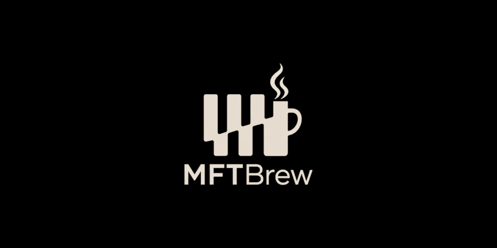

# mftbrew : micro four-thirds 
[](https://github.com/Saket-Upadhyay/mftbrew/actions/workflows/astro.yml)



A minimal photo portfolio built with Astro.

```yaml
Camera: OLYMPUS E-M10 Mark III (primary)
Phone: Apple iPhone 17 Pro (secondary)
Lenses: 40-150mm F4.0-5.6R | 25mm F2.0
Editing: Lightroom | GIMP
```

## Setup & Scripts

```shell
npm install
npm run dev       # Start development server
npm run build     # Build production app
npm run preview   # Preview production build
npm run check     # Run checks
npm run ci        # Run CI tasks
npm run prepare   # Install Git hooks
npm run thumbs    # Generate thumbnails
```

## License

The source code for this project is licensed under the [GPL-3.0 License](LICENSE).

All photographs and visual assets are [© Saket Upadhyay](LICENSE-ASSETS.md) and are not covered by the GPL license.  
Reuse of images requires explicit permission.
